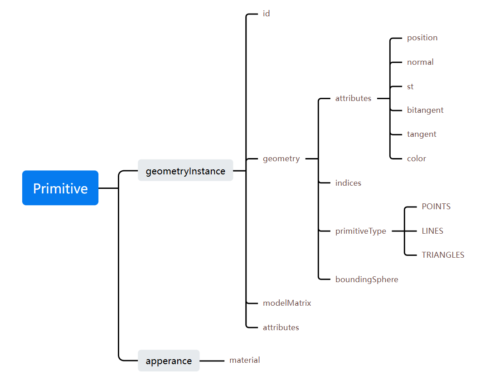

# Cesium 学习记录

(都是被逼得...我不当人了...)

## 1. 自定义几何——Primitive



## 2. 高阶用法——DrawCommand

```js
class MyPrimitive {
  constructor() {
    this.drawCommand = null;
  }
  createCommand(context) {}

  update(frameState) {
    if (!this.drawCommand) {
      this.createCommand(frameState.context);
    }
    frameState.commandList.push(this.drawCommand);
  }
}

var myPrimitive = new MyPrimitive();
viewer.scene.primitives.add(myPrimitive);
```
